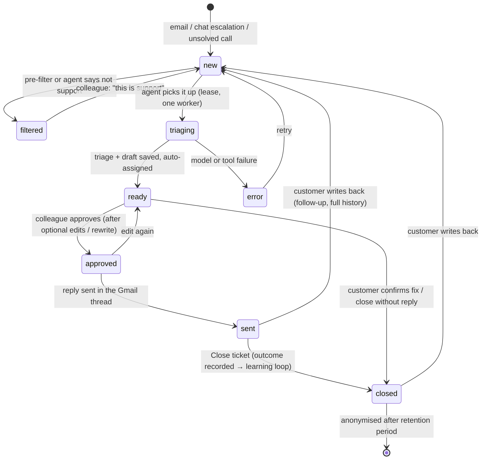
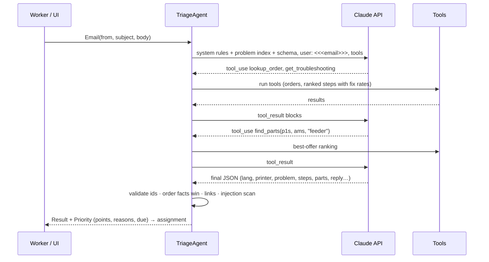

# Architecture

## Components

| Component | Where | Responsibility |
|---|---|---|
| UI | `frontend/index.html` | Customer chat, support inbox, phone quick mode, parts & offers, knowledge base, insights, settings |
| Runtime adapter | `frontend/local-runtime.js` | Gives the UI the same `window.claude` surface (`sample`, `db`) on top of the Java API when run locally |
| Triage agent | `backend/.../agent` | Claude Messages API tool-use loop, prompts, tools, output validation |
| Domain logic | `backend/.../triage`, `knowledge`, `parts`, `orders`, `team` | Priority, pre-filter, injection guard, learning loop, best offer, warranty, assignment |
| API | `backend/.../api` | REST endpoints, static files, JSON document store |
| Data | `data/` | 3DJake catalog snapshot, knowledge base, simulated history and orders |

## Ticket lifecycle



## One triage, step by step



## Learning loop

Every closed ticket stores which step solved it (or a free-text fix). For each step:

```
reached = cases where the step was tried or solved
fixed   = cases solved by the step
rate    = fixed / reached
```

`get_troubleshooting` returns free checks first and part replacements last, each group by rate.
Printer-specific stats are used once a printer has at least 8 cases for the problem. Free-text
fixes show up in the knowledge base, where a lead can approve them as new steps.

## Security model

- **Untrusted input**: customer text is wrapped in `<<< >>>`, and the prompt says it is data only.
  A regex scan (EN/DE/HU) flags override attempts for the colleague. Reply drafts are checked for
  links outside the shop's domain.
- **No autonomous actions**: the agent cannot send, refund or change orders. Its tools are read-only.
- **Least data**: tools return small summaries rather than raw records. Closed tickets are
  anonymised after the retention period.
- **Secrets**: the API key lives on the server (local mode). In claude.ai, calls run under the
  viewer's own account and connectors.
