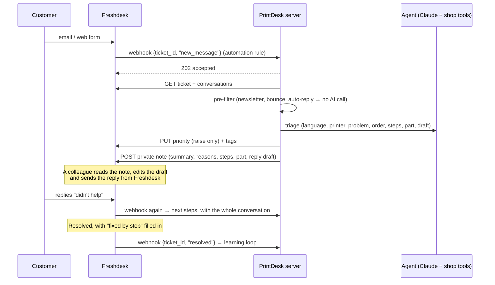

# Running PrintDesk inside Freshdesk

If the support team already works in Freshdesk, PrintDesk doesn't need its own inbox. The agent
works **inside Freshdesk**: it reads every new ticket and every customer reply, then writes its
result back into the ticket. The team keeps the tool it knows, and nothing new has to be learned.

Code: [`backend/src/main/java/com/printdesk/freshdesk/`](../backend/src/main/java/com/printdesk/freshdesk/),
tested in [`FreshdeskConnectorTest`](../backend/src/test/java/com/printdesk/freshdesk/FreshdeskConnectorTest.java).
The agent, the priority rules and the learning loop are the same code as in the PrintDesk inbox.
Only the mail transport is replaced.

## What happens



## What the agent writes into the ticket

| Field | Value |
|---|---|
| **Priority** | P1 → Urgent, P2 → High, P3 → Medium, P4 → Low. It is only **raised**, never lowered: a priority a colleague set stays. |
| **Tags** | `printdesk`, `lang-hu`, `printer-p1s`, `problem-p05`, plus `safety-risk`, `manipulation-attempt` and `escalate` when they apply. Existing tags are kept. Freshdesk views, reports and assignment rules can use them. |
| **Private note** | Priority with every reason, warnings, a 3-line summary, detected facts (language, printer, problem, warranty, order), the ranked steps, the recommended part with price, delivery time, stock and order link, and the **reply draft** in the customer's language. |

**The agent never replies to the customer.** It writes a private note only. A colleague copies
the draft into the reply, checks it and sends it. Human approval is built into the workflow.

Each customer message gets exactly one note. If Freshdesk calls the webhook twice, the second
call sees the note's reference and does nothing.

## Setup

**1. Freshdesk API key.** Use a dedicated agent account, e.g. "PrintDesk bot", so the notes
show who wrote them. Take the key from Profile settings → API key.

**2. Ticket field for the learning loop (optional).** Admin → Ticket fields → add a dropdown,
e.g. *Fixed by step*, with the step ids as values (`P05-S4`, …). Note its API name. The default
is `cf_printdesk_fixed_step`. Any other name goes into `FRESHDESK_FIXED_STEP_FIELD`.

**3. Automation rules** (Admin → Automations), each with the action *Trigger webhook*:

| Rule | When | Webhook body (JSON) |
|---|---|---|
| New ticket | Ticket is created (support channels only) | `{"ticket_id": {{ticket.id}}, "event": "new_message"}` |
| Customer replied | The requester adds a reply | `{"ticket_id": {{ticket.id}}, "event": "new_message"}` |
| Learning | Status changed to Resolved | `{"ticket_id": {{ticket.id}}, "event": "resolved"}` |

- Method: `POST`
- URL: `https://<printdesk-host>/api/freshdesk/webhook`
- Custom header: `X-PrintDesk-Token: <secret>`

**4. Run the server** where Freshdesk can reach it, behind HTTPS (reverse proxy):

```bash
export ANTHROPIC_API_KEY=sk-ant-...
export FRESHDESK_DOMAIN=yourshop                  # → https://yourshop.freshdesk.com
export FRESHDESK_API_KEY=...                      # the bot account's key
export FRESHDESK_WEBHOOK_TOKEN=$(openssl rand -hex 24)
export PRINTDESK_BIND=0.0.0.0                     # default 127.0.0.1
java -jar backend/target/printdesk.jar
# → "Freshdesk: webhook enabled at /api/freshdesk/webhook for https://yourshop.freshdesk.com"
```

## Security

- **The webhook needs the token.** It is compared in constant time. Without it the answer is
  `401` and nothing runs.
- **Least privilege:** the bot account only needs to read tickets, add notes and update
  priority and tags.
- Customer text stays **untrusted data** for the agent, as in the inbox. Manipulation attempts
  are tagged and shown in red in the note. All shop tools are read-only.
- The webhook answers `202` at once and works in the background, because the agent takes
  longer than Freshdesk waits for a webhook response.
- When Freshdesk returns `429 Too Many Requests`, the client waits for `Retry-After` and tries
  once more.

## Testing it

`FreshdeskConnectorTest` covers, with a fake Freshdesk and a canned agent answer:

- a new ticket gets priority, tags and a private note, and `/reply` is never called;
- a customer reply is handled with the earlier conversation, and a duplicate webhook writes
  nothing;
- a newsletter is set aside without calling the agent;
- a priority a colleague set is never lowered, and manipulation attempts are flagged;
- a resolved ticket with *Fixed by step* goes into the learning loop.

The whole path was also run end to end: the real server, with mock Freshdesk and Claude APIs on
localhost. The webhook without a token was refused. With the token the ticket was read with
Basic auth, and the priority, tags and note were written back.

## Limits and next steps

- Attachments (photos) aren't passed to the agent yet. The Freshdesk API returns attachment URLs,
  so this is a small addition.
- Learned outcomes are kept in memory. In production they go into the database, like tickets
  (see [integration.md](integration.md)).
- Nicer for the team: a small **Freshdesk app** in the ticket sidebar with an *Insert draft*
  button, so the draft goes into the reply box with one click instead of copy and paste.
- Freshdesk has its own AI features. PrintDesk adds what is specific to the shop: order and
  warranty checks, part compatibility and stock, fix rates learned from real outcomes,
  explainable priority, and an eval set to measure it.
